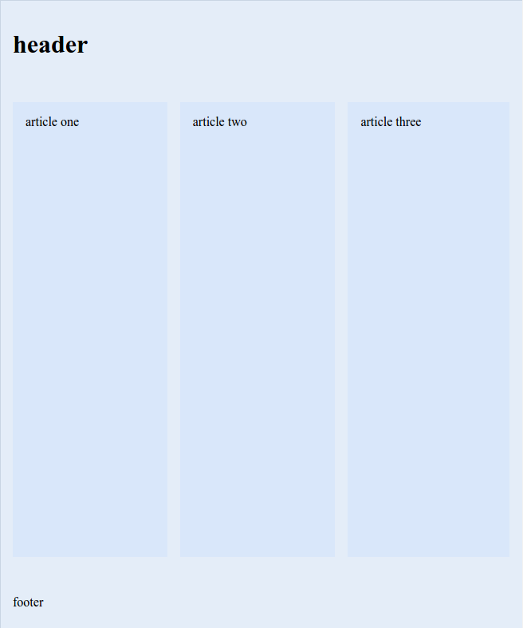

flexbox
=======

An attribute-based flexbox implementation.

Note, the `<at-flexbox>` tag only exists for completeness (since other riot tags will use it, it makes sense to have it exist as a dependency).
In most cases, the attributes should be used on other, semantically appropriate elements.

attribute api
-------------

### `flexbox`
Sets the element as a flex container (`display: flex`).
Optional values can specify wrapping and content justification.
- `wrap`|`reverse`:  Specifies `flex-wrap` value (omit for default (`none`)).
- `end`|`center`|`between`|`around`:  Specifies `justify-content` value (omit for default (`start`)).
- `inline`: Makes the flex container an `inline-flex` container (omit for default (`flex`)).
- `row`|`column`: Sets the main axis for the flex container.
  Use `column` to specify the vertical axis; omit to specify the horizontal axis.
  _(The horizontal axis is the default main axis for flex containers, so there is no need for a "row" value.
  But you can type it anyway, if it makes you feel better.)_
- `reverse`: Reverses the main axis (`flex-direction: column-reverse` if `column` is set; `row-reverse` otherwise).
- `gutter`: Adds a margin between each of the container's flex items (omit for no margins).

### `flex-items`
Sets the default alignment of the container's flex items (`align-items`).
This value can be overridden by the flex items themselves (see `item-align`).
- `start`|`end`|`center`|`baseline`:  Specifies the default item alignment (omit for default (`stretch`)).
- `grow`:  Sets the flex items to grow by default (`flex-grow: 1`).  Omit for no growth by default.

### `flex-contents`
Sets the alignment of the flex items on the cross axis (`align-content`).
- `start`|`end`|`center`|`between`|`around`:  Specifies content alignment (omit for default (`stretch`)).

### `item-align`
On a flex item (meaning, for our purposes, a direct child of a `flexbox` element),
overrides the flex-item's alignment or display order (`align-self` and `order`).
Only a limited number of values for `order` are provided
(and I don't expect them to see a lot of use;
there are likely better ways to do it in any given case).
- `start`|`end`|`center`|`baseline`|`stretch`:  Specifies flex item's self-alignment.
  If omitted, defaults to value specified in parent `flexbox`'s `item` attribute, or `stretch` if none.
- `1`|`2`|`3`|`4`|`5`:  Sets the display order of the flex item (omit for default (source order)).

### `item-grow`
On a flex item (direct child of a `flexbox` element), sets the `flex-grow` and `flex-shrink` values,
possibly overriding defaults set on the flex container.
As with `item-align`, only a limited number of values are provided.
- `1`|`0`: Sets the flex item to grow or not grow when necessary.
  If omitted, defaults to `1` if `items="grow"` is set on the flex container, or `0` otherwise.
- `-1`: Sets the flex item to shrink when necessary (omit for default (`0`)).

examples
--------

### _a typical website layout_
A website with a full-width header and a "sticky" footer.
Articles in the main content area are displayed as columns.



_html_
```html
<body flexbox="column">
  <header>
    <h1>header</h1>
  </header>
  <main flexbox="gutter" grow>
    <article>article one</article>
    <article>article two</article>
    <article>article three</article>
  </main>
  <footer>
    <p>footer</p>
  </footer>
</body>
```

_css_
```css
/* make sure the body takes up the whole screen */
html, body {
  height: 100vh;
  margin: 0;
  padding: 0;
}

/* this is just styling to illustrate how the different areas lay out;
   could be anything you like */
header, main, article, footer {
  padding: 1em;
  background: rgba(180, 210, 255, 0.25);
}
```

See [the demo file](demo/flexbox.html) for more.
