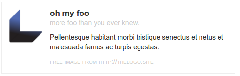
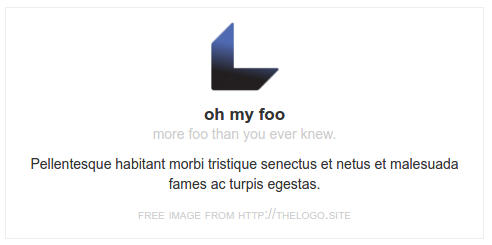
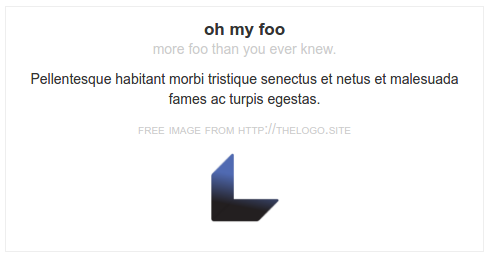
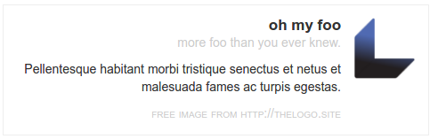
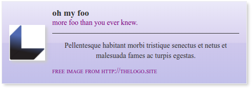

media
=====

A generalized _media_ element, based on [Nicole Sullivan's "media object" concept](http://www.stubbornella.org/content/2010/06/25/the-media-object-saves-hundreds-of-lines-of-code/).

attribute api
-------------

### `src`
Sets the `src` attribute of the image.  Omit for no image.

### `alt`
Sets the `alt` attribute of the image.  Defaults to an empty string.

### `width`
Sets the width of the image.  Accepts any css length value.  Defaults to `5em`.

### `height`
Sets the height of the image.  Accepts any css length value.  Defaults to "`auto`."

### `title`
Sets the title in the content header.  Accepts any text value.  Omit for no header.

### `tagline`
Sets the subtitle in the content header.  Accepts any text value.  Omit for no tagline.

### `footer`
Sets the text for the content footer.  Accepts any text value.  Omit for no footer.

### `layout`
Sets the layout for the media element.
- `row`: places the image to the left of the content; content is left-aligned.  This is the default layout.
- `reverse`: places the image to the right of the content; content is right-aligned
- `column`: centers the image above the content; content is centered
- `column reverse`: centers the image below the content; content is centered

Note, `<at-media>` is a flexbox-based element,
and so it is possible to pass other [`flexbox` attribute values](../flexbox/README.md) via the `layout` attribute.
This may have unexpected results, however, and is not supported nor recommended.

yielding api
------------

### `yield`
Element contents are yielded to `at-media-content article`.  This element will be empty if no content is present.

### `yield to=media`
When the `src` attribute is set to an empty string, `media` contents will be yielded to `at-media-media`.

### `yield to=header`
When the `title` attribute is set to an empty string, `header` contents will be yielded to `at-media-content header`.

### `yield to=footer`
When the `footer` attribute is set to an empty string, `footer` contents will be yielded to `at-media-content footer`.

examples
--------

### _layouts_

A demo showing the four basic layouts (row|column|reverse column|reverse row).
Each uses the same html (below) with the corresponding `layout` attribute (see above for more details).
Note, by default, the `<at-media>` element will expand to fill the width of its parent container.

_html_
```html
<at-media
  src="http://i.imgur.com/sL1cy3Y.png"
  title="oh my foo"
  tagline="more foo than you ever knew."
  footer="free image from http://thelogo.site">
  <p>Pellentesque habitant morbi tristique senectus et netus et malesuada fames ac turpis egestas.</p>
</at-media>
```

_row layout (default)_



_column layout_



_reverse column layout_



_reverse row layout_



### _theming_

The media element is designed to allow for easy styling.
Adding a class name for custom styles is highly recommended; overriding the default styles should be avoided.
The html structure of the media element is as follows:
```html
<at-media>
  <at-media-media>
     <!-- optional, omitted if no `src` -->
  </at-media-media>
  <at-media-content>
    <header> <!-- optional, omitted if no `title` -->
      <h1></h1>
      <p></p> <!-- optional, omitted if no `tagline` -->
    </header>
    <article>
      <!-- content is yielded here -->
    </article>
    <footer></footer> <!-- optional, omitted if no `footer` -->
  </at-media-content>
</at-media>
```

For example, a custom theme might include the following styles:
```css
at-media.my-theme {
  font-family: serif;
  background: linear-gradient(to bottom,  #ebe9f9 0%,#d8d0ef 50%,#cec7ec 51%,#c1bfea 100%);
  box-shadow: .25em .25em .5em #ccc;
}
at-media.my-theme at-media-media {
  align-self: center;
}
at-media.my-theme at-media-media img {
  box-shadow: .25em .25em .5em #ccc;

}
at-media.my-theme at-media-content header {
  border-bottom: 1px solid #333;
  margin-bottom: 1em;
}
at-media.my-theme at-media-content header p,
at-media.my-theme at-media-content footer {
  color: purple;
}
at-media.my-theme at-media-content article {
  text-align: center;
}
```

It would be applied to the media element like so:
```html
<at-media class="my-theme" . . .>
  . . .
</at-media>
```

And would result in:


